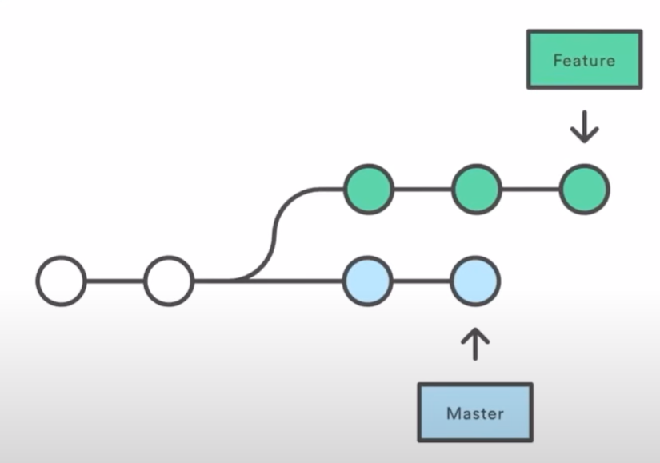

# just-started
This is my first git repo.
> 📝 These are my personal notes from the [Apna College Git & GitHub Tutorial](https://youtu.be/Ez8F0nW6S-w?si=d-SCm0I9NTHsE6FH).


## 📌 Commit: A 2-Step Process
- The `commit` → means the changes whatever you have done, you are fixing it.
- After every commit, Git stores the info (saves your commit) and the date you commit.
- In order to change → you `add` (a change) and then commit.

## 📥 Clone
- Copy the link from the "Code" dropdown of the GitHub repo.
- Create a new folder and type or Open any existing folder where you want to clone this repo:  
  `git clone [paste your link here]`
- Your Git repo gets cloned into the folder.

## 🧭 Basic Commands
- `cd just-started` → moves your directory to `just-started` repository (`just-started` is the name of my repo; you have to type your repository name there or use autotype).
- `ls` → shows the list of files in your repo or in that directory.
- `ls -a` → shows hidden files. Every Git-integrated folder has a `.git` folder to track your changes.
 > In Vs Code Windows terminal, if that is not working then you can use `ls -Hidden`

## 🔍 Status
- `git status` → shows what branch you are on
    - whether you have saved (committed) your file 
    - whether you have any changes to be made, like you have added but haven't commited
    - you have commited but haven't pushed

### Git Status Types
1. `untracked` → new files that **Git doesn't yet track**, even if you modify or add new stuff.
2. `modified` → files that already exist but are changed.
3. `unmodified` → files that already exist and are unchanged.
4. `staged` → after you `add` your changed code, it becomes staged and ready to `commit`.

## ✍️ Tracking Changes
Git uses two commands:
1. `add`
2. `commit`

### Add
Adds new or changed files in your working directory to the Git staging area.

> Staging area → where the unmodified and untracked files exist.

To add a single file:  
`git add <file name>`

To add all files:  
`git add .`

### Commit
Records the change.  
Syntax:  
`git commit -m "some message"`  
Here `-m` means your commit has a message.

> What you have saved now won't show on the GitHub page — it's saved locally on your laptop.

## 🚀 Push
Uploads local repo content to the remote repo.

- **Local repo** → saved on your laptop or PC  
- **Remote repo** → saved on GitHub

Syntax:  
`git push origin main`

### What does this mean?
- All GitHub repositories are remote repos.
- We choose one default remote repo to push to — called `origin`.
- `main` is the branch name where the `origin` repo exists.

You can also use:  
`git push -u origin main`  
`-u` sets upstream, so next time you can simply type:  
`git push`

> You might be wondering what upstream means, It simply means that you would always push your commited changes to `origin main` 
> 
> It is to ease your process of typing, You can also do `git push -u origin feature1`
> 
> if you are always going to push to `feature1` branch

## 🛠️ Init Command
Used to create a new Git repo.

If you build a project or write a code file locally and want to upload it to GitHub:  
`git init`

To add a new remote repo from local:  
`git remote add origin <link>`

To check which remote repo you've added:  
`git remote -v`

## 🔄 GitHub Workflow
1. Create GitHub repository (remote file).
2. `clone` the repo into local file.
3. Make changes in the code.  
   *(Don't forget to save files in VS Code or changes won't reflect in terminal.)*
4. `add`
5. `commit`
6. `push`

## 🌿 Branching
Suppose there are 3 teams:
1. Frontend  
2. Backend  
3. Bug fix

There will be a main branch.  
Each team creates their own branches from the main branch.  
From that point onward, they get a copy of the code/repo.



This tree-like structure is called the **Working Tree**.

### Branch Commands
- Check current branch:  
  `git branch`
- Rename branch:  
  `git branch -M newName`
- Switch to another branch:  
  `git checkout <branch name>`
- Create new branch:  
  `git checkout -b <new branch name>`
- Delete branch:  
  `git branch -d <branch name>`

## 🔀 Merging Code

### Using Terminal
1. Compare branches:  
   `git diff <branch name>`  
   Shows every change between your current branch and the one you're comparing.

   > Press `q` to exit scroll.
   > If terminal shows `[END]`, It means the end of output and the output would be repeated if you keep scrolling down.

2. Merge branches:  
   `git merge <branch name>`  
   When two branches' code becomes the same, you can merge them.

### Using GitHub
1. Create a **PR** (Pull Request)  
   Lets others know about changes you've pushed to a branch.

   > If many people work on a project and want to merge with `main` branch of base repo, they create a PR.

2. **PR Review**  
   Senior dev (or maintainer) reviews your code and comments or approves it.

## 📥 Pull Command
Fetches and downloads content from a remote repo and updates your local repo.

Syntax:  
`git pull origin main`

## ⚔️ Resolving Merge Conflicts
Occurs when Git can't automatically resolve differences between two commits.

Example:

**Main branch:**
```html
<p>New repo created</p>
<p>This is a new feature [button]</p>
```

**Feature1 branch:**
```html
<p>New repo created</p>
<p>This is a new feature [dropdown]</p>
```

Git can't decide which to keep — this causes a merge conflict.

You are on `feature1` branch and typed `git merge main` 
Your resolutions by the smart editor would be as follows:

### Resolution
VS Code suggests: 
- **Incoming change** → accept changes from main branch
- **Current change** → accept changes from your feature1 branch

## ⏪ Undoing Changes

### Case 1: Staged Changes
You added changes but haven't committed yet.  
To undo:  
- Single file: `git reset <file name>`  
- Entire branch: `git reset`

### Case 2: One Commit
`git reset HEAD~1`  
Moves HEAD to the previous commit and erases the current one.

### Case 3: Multiple Commits
`git reset <commit hash>`  
Each commit has a unique hash (viewable via `git log`).

## 🍴 Fork
A fork is a new repo that shares code and visibility with the original "upstream" repo.

If you want to work on someone else's project:
1. Open their repo.
2. Click **Fork** → **Create new fork** → Name it.
3. You now have their repo and can make changes.
4. Create a PR — the maintainer will review and accept or comment.

